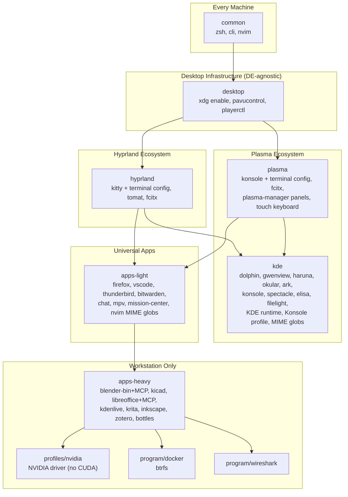
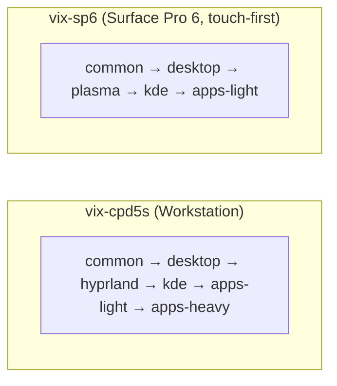
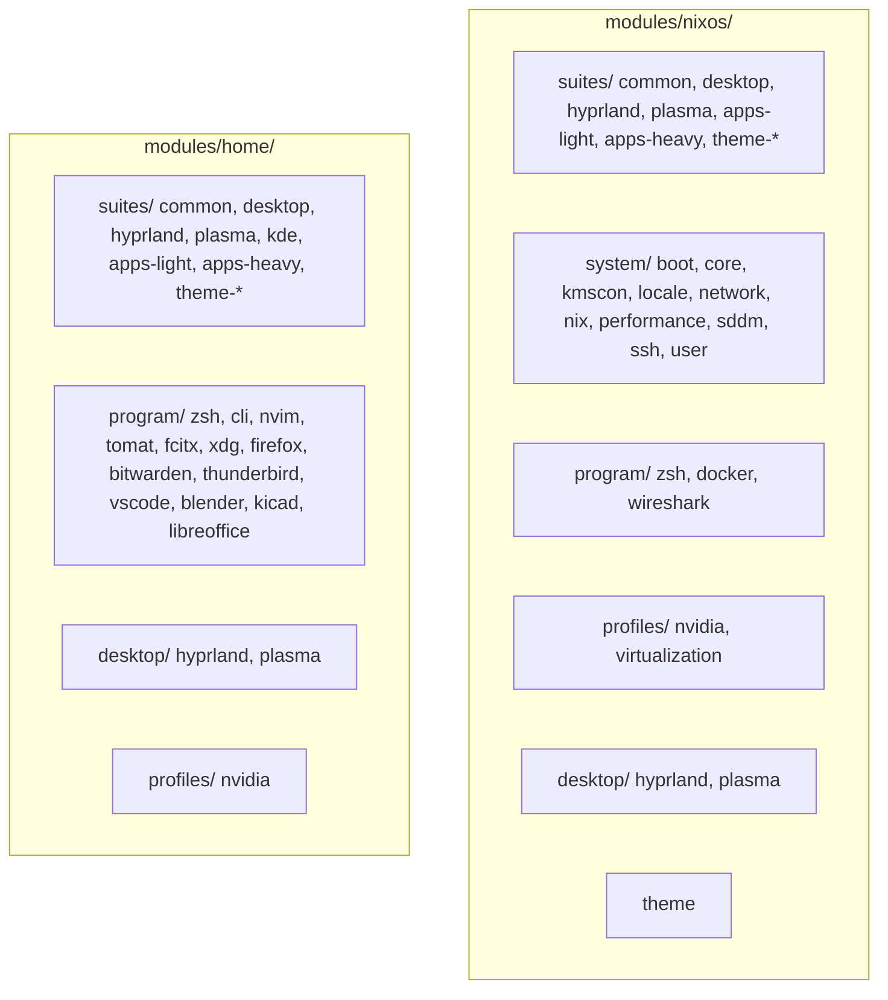
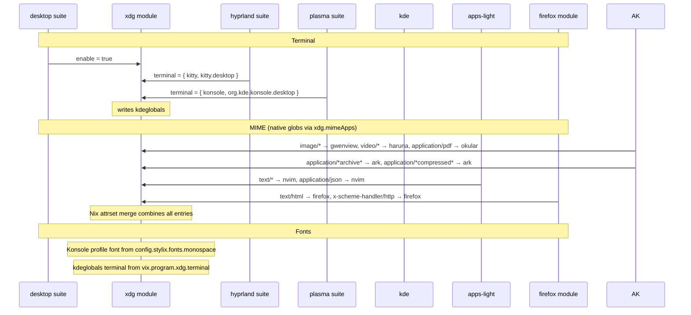

# Architecture

## Suite Dependency Graph

## Multi-Device Strategy

`desktop`, `apps-light` and `kde` are shared across DEs. `kde` bundles the KDE app ecosystem (Dolphin, Konsole, Okular, ...) plus MIME defaults and the Konsole profile; `desktop/plasma` auto-enables `kde` and handles DE wiring (plasma6 module, powerdevil), while plasma-manager owns layout/behavior (panels, kwinrc). Touch-specific bits — bottom dock panel, kwinrc virtual keyboard (fcitx5 wayland launcher), and touch apps (angelfish/koko/tokodon) — are gated behind `desktop.plasma.mobile.enable` / `suites.kde.mobile.enable`. Stylix remains the single theme source.

Host-level hardware integration (not repo modules):
- `vix-sp6` imports `nixos-hardware.nixosModules.microsoft-surface-pro-intel` (linux-surface patched kernel, firmware, thermald, surface-control) and defines its disks declaratively via `disko.devices` — install-time partitioning is a single `disko --mode disko --flake .#vix-sp6` command.

## Session Management

Display manager (SDDM) and the default session are **not** chosen by the suites or desktop modules — each device opts in explicitly at the top of its `systems/.../default.nix`:

- `vix-cpd5s` → SDDM + `defaultSession = "hyprland-uwsm"` (Hyprland wrapped by [uwsm]).
- `vix-sp6` → SDDM + `defaultSession = "plasma"` (Plasma's native systemd session).

[uwsm] (Universal Wayland Session Manager) wraps standalone compositors in systemd user units, binding them into `graphical-session.target` so the session tears down cleanly on logout — this fixes stale-login and tty-switch greeter issues. `desktop/hyprland` sets `programs.hyprland.withUWSM = true` and `home/desktop/hyprland` disables Hyprland's own `systemd.enable` (they conflict). Plasma 6 already manages its session via `startplasma-wayland`, so it does not use uwsm.

## Module Layout

## Producer / Consumer Pattern

## Design Principles

1. **DE-agnostic modules don't reference specific apps.** `xdg` exposes `terminal` option but doesn't set it. `desktop` has pavucontrol but not kitty. `apps-light` has mpv but not haruna.

2. **DE-specific bundles own their ecosystem.** `kde` bundles all KDE apps + MIME + Konsole config. A future `apps-gnome` would do the same with GNOME apps.

3. **MIME uses native globs.** `xdg.mimeApps.defaultApplications` supports `image/*` natively, no external tool needed.

4. **Stylix is the single source of truth for theming.** Fonts, colors, cursors flow from `config.stylix.fonts` and `config.lib.stylix.colors`.

5. **Heavy apps are opt-in via `apps-heavy` suite.** Blender, KiCad, LibreOffice, Kdenlive, Krita only on workstation.

6. **Suites mirror at NixOS and Home levels.** Each logical concept (common, desktop, hyprland, apps-light, apps-heavy, theme-*) exists at both `modules/nixos/suites/` and `modules/home/suites/`.
